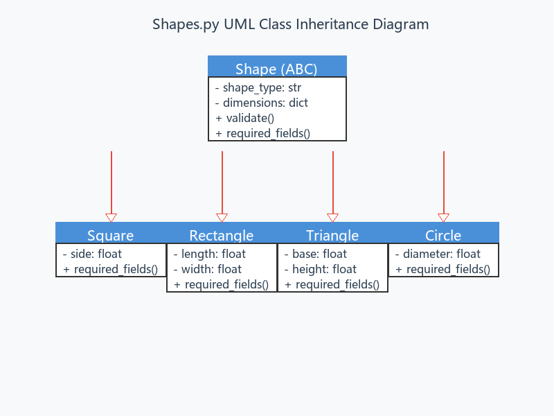

# 通用面积计算器 | Universal Area Calculator

> 基于 Python 面向对象与模块化设计的几何图形面积计算工具，支持正方形、长方形、三角形、圆形四种图形，厘米/英寸双单位输入并自动换算，标准化三位小数输出。

---

## 项目概述

本项目为软件工程训练营第二次作业，基于第一次作业的代码编写完整的 `README.md` 介绍文档。项目采用**一人一模块**的分层解耦架构，将图形界面、图形类设计、面积计算、单位换算、结果输出完全拆分，各模块职责单一、通过公开接口调用，高度模拟企业团队开发流程。

### 支持图形

| 图形 | 标识 | 所需参数 |
|------|------|----------|
| 正方形 | `square` | `side`（边长） |
| 长方形 | `rectangle` | `length`（长）、`width`（宽） |
| 三角形 | `triangle` | `base`（底）、`height`（高） |
| 圆形 | `circle` | `diameter`（直径） |

### 核心特性

- **面向对象继承体系**：抽象基类 `Shape` + 四个具体子类 + 工厂函数
- **双单位自适应**：`cm` / `inch` 自动换算（1 inch = 2.54 cm）
- **全局异常拦截**：空输入、非数字、零值、负数均有友好提示
- **高精度计算**：计算过程不四舍五入，输出统一保留 3 位小数
- **纯 Python 标准库实现**：零第三方依赖

---

## Project Title

**通用面积计算器（Universal Area Calculator）**——一个模块化、面向对象的 Python 几何图形面积计算工具。

本项目由五人小组协作完成，核心目标是通过实践掌握面向对象设计原则（继承、多态、工厂模式）与模块化工程思想。程序将交互、实体、计算、转换、输出各模块完全解耦，降低代码耦合度，便于后续扩展新图形、新增计量单位。

---

## Getting Started

### Prerequisites

- **Python 版本**：Python 3.8 及以上（推荐 3.10-3.12）
- **操作系统**：Windows 10/11、macOS、Linux 均可
- **运行工具**：终端 / PowerShell / Git Bash，用于执行 Python 脚本
- **额外依赖**：无，仅使用 Python 标准库

### Installing

1. 克隆或下载本仓库全部源码，保持目录结构不变：

   ```bash
   git clone https://github.com/P1ngye/summer_courses.git
   cd summer_courses
   ```

2. 核对本地文件结构，确保文件齐全：

   ```
   summer_courses/
   ├── README.md                          # 项目总说明（本文件）
   ├── shapes.py                          # 图形类设计模块
   ├── result_formatter.py              # 结果格式化输出模块
   ├── unit_converter.py                  # 输入校验与单位换算模块
   ├── assignment_1/
   │   ├── area_calculator.py             # 面积计算核心模块
   │   ├── tests/
   │   │   └── test_area_calculator.py    # 面积计算单元测试
   │   └── 第一次作业_五人分工清单.md      # 团队分工说明
   ├── shapes.README/
   │   ├── README.md                      # shapes.py 模块详细文档
   │   └── shapes_uml.png                 # UML 类继承关系图
   ├── README.yt/
   │   └── README.md                      # 项目说明（杨婷版本）
   └── U202412724-荣伊润-第二次作业/
       └── ReadMe.md                      # 项目说明（荣伊润版本）
   ```

3. 无需 `pip install` 任何包，直接运行各模块自测代码：

   ```bash
   python shapes.py              # 图形类自测
   python unit_converter.py      # 单位换算自测
   python result_formatter.py    # 结果格式化自测
   ```

---

## Running the tests

### 1. 各模块独立自测

每个模块文件底部均包含自测代码，可直接运行验证：

```bash
# 测试图形类继承与工厂函数
python shapes.py

# 测试输入校验与单位换算
python unit_converter.py

# 测试结果格式化输出
python result_formatter.py
```

### 2. 单元测试（unittest）

使用 Python 内置 `unittest` 框架对面积计算模块进行自动化测试：

```bash
cd assignment_1
python -m unittest tests/test_area_calculator.py -v
```

或：

```bash
cd assignment_1
python -m pytest tests/test_area_calculator.py -v
```

### 3. 功能标准测试用例

| 图形 | 输入参数 | 预期面积 |
|------|----------|----------|
| 正方形 | 边长 2 cm | 4.000 平方厘米 |
| 长方形 | 长 3 cm、宽 4 cm | 12.000 平方厘米 |
| 三角形 | 底 6 cm、高 4 cm | 12.000 平方厘米 |
| 圆形 | 直径 2 cm | 3.142 平方厘米 |

### 4. 异常容错测试

以下输入均被捕获并抛出带中文提示的 `ValueError`，程序不会崩溃：

| 异常类型 | 示例输入 | 预期行为 |
|----------|----------|----------|
| 空字符串 | `""` | 抛出 `ValueError: 长度不能为空` |
| 非数字 | `"abc"` | 抛出 `ValueError: 长度不是有效数字` |
| 零值 | `0` | 抛出 `ValueError: 长度必须大于0` |
| 负数 | `-3` | 抛出 `ValueError: 长度必须大于0` |
| 未知图形 | `"hexagon"` | 抛出 `ValueError: unsupported shape type` |
| 缺失参数 | `{"length": 3}`（缺 width） | 抛出 `ValueError: missing width` |

---

## Usage

### 模块 API 使用示例

以下展示如何将四个核心模块组合调用，完成从用户输入到结果输出的完整流程：

```python
from shapes import create_shape
from unit_converter import parse_dimensions
from assignment_1.area_calculator import calculate_area
from result_formatter import build_result

# 1. 用户输入（以英寸为例）
raw_input = {"side": "2"}   # 用户输入边长为 2
unit = "inch"                # 用户选择单位为英寸

# 2. 校验并统一换算为厘米
dimensions_cm = parse_dimensions(raw_input, unit)
# → {"side": 5.08}

# 3. 使用工厂函数创建图形对象
shape = create_shape("square", dimensions_cm)

# 4. 调用面积计算模块
area = calculate_area(shape.shape_type, shape.dimensions)

# 5. 格式化输出结果
result_text = build_result(shape.shape_type, shape.dimensions, area)
print(result_text)
```

**输出结果：**

```
图形类型：正方形
边长：5.080 厘米
面积：25.806 平方厘米
```

### 各模块独立 API

#### shapes.py — 图形类设计（王菲）

| 类/函数 | 说明 |
|---------|------|
| `Shape(ABC)` | 抽象基类，定义统一接口 |
| `Square` | 正方形子类，参数：`side` |
| `Rectangle` | 长方形子类，参数：`length`、`width` |
| `Triangle` | 三角形子类，参数：`base`、`height` |
| `Circle` | 圆形子类，参数：`diameter` |
| `create_shape(type, dimensions)` | 工厂函数，根据类型名创建对应图形对象 |

```python
from shapes import create_shape

# 创建正方形：边长 5.0 厘米
square = create_shape("square", {"side": 5.0})

# 创建圆形：直径 2.0 厘米
circle = create_shape("circle", {"diameter": 2.0})
```

#### area_calculator.py — 面积计算（喻麒麟）

| 函数 | 公式 | 参数 |
|------|------|------|
| `square_area(side)` | `side²` | `side`（边长） |
| `rectangle_area(length, width)` | `length × width` | `length`（长）、`width`（宽） |
| `triangle_area(base, height)` | `base × height / 2` | `base`（底）、`height`（高） |
| `circle_area(diameter)` | `π × (diameter / 2)²` | `diameter`（直径） |
| `calculate_area(type, dimensions)` | 统一分派 | 图形类型 + 参数字典 |

```python
from assignment_1.area_calculator import calculate_area

# 正方形面积：2² = 4.0
area = calculate_area("square", {"side": 2.0})

# 圆形面积：π × (2/2)² = π
area = calculate_area("circle", {"diameter": 2.0})
```

#### unit_converter.py — 输入校验与单位换算（荣伊润）

| 函数 | 功能 |
|------|------|
| `parse_positive_number(text, field_name)` | 文本转大于 0 的浮点数 |
| `to_centimeters(value, unit)` | 厘米/英寸换算 |
| `parse_dimensions(raw_values, unit)` | 批量校验并换算为厘米字典 |

```python
from unit_converter import parse_dimensions

# 英寸输入 → 厘米输出
raw = {"side": "2"}
result = parse_dimensions(raw, "inch")
# → {"side": 5.08}
```

#### result_formatter.py — 结果格式化输出（杨婷）

| 函数 | 功能 |
|------|------|
| `format_length(value_cm)` | 格式化长度，保留 3 位小数 |
| `format_area(value_cm2)` | 格式化面积，保留 3 位小数 |
| `build_result(type, dimensions_cm, area_cm2)` | 组装完整结果文本 |

```python
from result_formatter import build_result

text = build_result("square", {"side": 5.0}, 25.0)
print(text)
```

**输出：**

```
图形类型：正方形
边长：5.000 厘米
面积：25.000 平方厘米
```

### 架构设计

#### UML 类继承关系



上图展示了 `shapes.py` 模块的面向对象设计：

- **抽象基类 `Shape`**：定义统一接口，包含 `shape_type`、`dimensions`、`validate()`、`required_fields()`
- **四个具体子类**：`Square`、`Rectangle`、`Triangle`、`Circle`，各自实现 `required_fields()` 返回所需字段
- **工厂函数 `create_shape()`**：封装对象创建逻辑，调用方无需关心子类构造细节

#### 数据约定

| 约定项 | 说明 |
|--------|------|
| 图形名称 | `"square"`、`"rectangle"`、`"triangle"`、`"circle"` |
| 长度数据 | 字典形式，如 `{"side": 5.0}`、`{"length": 5.0, "width": 3.0}` |
| 单位标准 | 进入图形类前所有长度必须已换算为厘米 |
| 圆形参数 | 接收直径（diameter），非半径 |
| 面积精度 | `float` 类型，计算不提前四舍五入，输出保留 3 位小数 |
| 错误处理 | 各模块抛出带中文描述的 `ValueError` |

---

## Contributing

本项目由五人小组协作完成，每位成员负责一个独立模块：

| 成员 | 负责模块 | 核心贡献 |
|------|----------|----------|
| **王澔博**（组长） | main.py | 图形界面、程序入口、模块调度、全局异常捕获 |
| **王菲** | shapes.py | 图形基类与子类继承设计、工厂方法、OOP 架构 |
| **喻麒麟** | area_calculator.py | 四种图形面积计算公式、高精度计算逻辑 |
| **荣伊润** | unit_converter.py | 输入校验、英寸/厘米单位换算、数据预处理 |
| **杨婷** | result_formatter.py | 结果格式化、小数统一、标准化输出展示 |

### 协作规范

1. **一人一模块**：每位成员仅维护一个独立 Python 文件，避免多人同时修改同一文件
2. **接口约定**：模块之间只调用公开函数，统一使用图形名称和参数字典的数据格式
3. **自测要求**：每个模块底部包含自测代码，提交前确保可独立运行
4. **Git 追溯**：每位成员保留可追溯的 Git 提交记录

---

## Versioning

本项目采用语义化版本管理（Semantic Versioning），主要版本迭代如下：

### v0.1.0 — 基础架构搭建

- 王菲：创建 `shapes.py`，实现 `Shape` 抽象基类及四个子类
- 喻麒麟：创建 `assignment_1/area_calculator.py`，实现面积计算公式与分派逻辑
- 荣伊润：创建 `unit_converter.py`，实现输入校验与单位换算
- 杨婷：创建 `result_formatter.py`，实现结果格式化输出

### v0.2.0 — 模块整合与测试

- 王澔博（组长）：编写 `main.py` 图形界面，整合各模块为完整程序
- 喻麒麟：补充 `assignment_1/tests/test_area_calculator.py` 单元测试
- 全组：联调测试，确认图形选择、参数输入、单位换算、结果输出全流程正常

### v0.3.0 — 文档完善

- 王菲：编写 `shapes.README/README.md` 及 UML 类图
- 杨婷：编写 `README.yt/README.md` 项目说明
- 荣伊润：编写 `U202412724-荣伊润-第二次作业/ReadMe.md`
- 全组：完善 README.md，补充使用说明、测试用例、API 文档

### v1.0.0 — 正式版本（当前）

- 模块解耦完成，接口标准化
- 异常处理全覆盖，程序稳定性达标
- 文档完整，包含架构图、API 说明、测试指南

---

## Authors

- **王澔博** — 组长 / 图形界面与程序入口
- **王菲** — 图形类设计与面向对象架构
- **喻麒麟** — 面积计算核心模块
- **荣伊润** — 输入校验与单位换算
- **杨婷** — 结果格式化输出

指导教师：唐海益

---

## License

本项目仅用于 **软件工程训练营课程学习与作业提交**，禁止任何商业用途。代码与文档版权归 respective authors 所有，未经授权不得用于课程外的任何场景。

---

## Acknowledgments

- 感谢唐海益老师的悉心指导与作业要求设计
- 感谢小组五名成员的紧密协作与模块分工
- 感谢 Python 标准库 `abc`、`math`、`unittest` 提供的强大基础能力
- 感谢 Git 版本控制工具帮助团队实现可追溯的协作开发

---

> **作业说明**：本文档为第二次作业成果，基于第一次作业的 `shapes.py`、`area_calculator.py`、`unit_converter.py`、`result_formatter.py` 四个核心模块撰写，严格遵循 Markdown 规范与 README.md 标准格式。