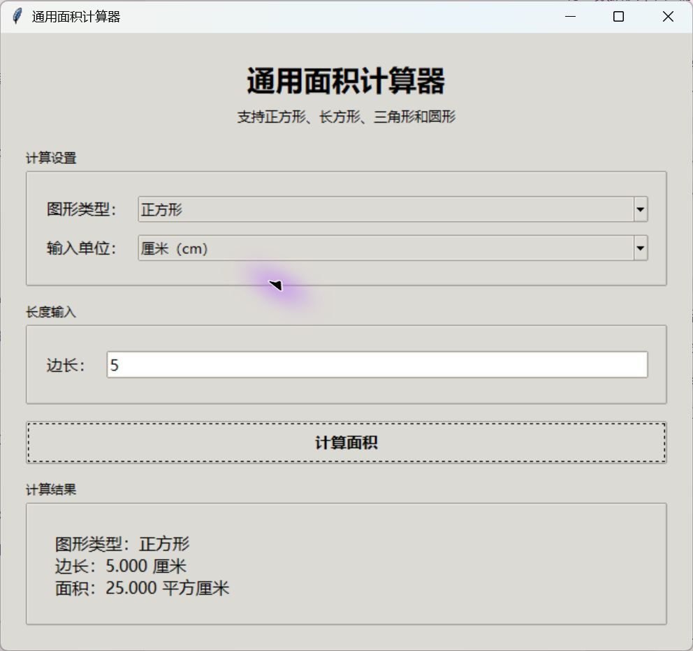

# 通用面积计算器（Universal Area Calculator）

> 使用 Python 与 Tkinter 编写的桌面面积计算工具。程序支持四种图形、厘米与英寸两种单位，并通过五个独立模块完成输入、建模、计算和结果显示。



## 1. Project Title｜项目名称

**项目名称：通用面积计算器**

本项目可以计算正方形、长方形、三角形和圆形的面积。用户在图形界面中选择图形与单位，填写相应长度后即可得到结果。输入的英寸会先换算为厘米，最终长度和面积都保留三位小数。

我在第一次作业中负责 `main.py`，主要工作是设计图形界面、根据图形动态生成输入框、调用其他成员提供的模块，并统一显示错误信息和计算结果。

### 主要功能

- 支持正方形、长方形、三角形和圆形
- 支持厘米（`cm`）和英寸（`inch`）
- 根据图形自动显示边长、长宽、底高或直径输入框
- 检查空值、非数字、零和负数
- 统一以厘米和平方厘米输出，保留三位小数
- 使用 Tkinter 图形界面完成全部操作

## 2. Getting Started｜开始使用

### Prerequisites｜运行条件

| 项目 | 要求 |
| --- | --- |
| Python | 3.9 或更高版本 |
| 图形界面 | Tkinter（Python 标准库） |
| 第三方依赖 | 无 |
| 操作系统 | Windows、macOS 或 Linux |

> Windows 官方 Python 通常已经包含 Tkinter，不需要另外安装第三方包。

### Installing｜安装与启动

1. 下载仓库中的 `assignment_1` 文件夹。
2. 保持其中的 Python 文件位于同一目录。
3. 进入该目录并运行主程序：

```bash
cd assignment_1
python main.py
```

完整程序包含以下文件：

```text
assignment_1/
├── main.py
├── shapes.py
├── area_calculator.py
├── unit_converter.py
├── result_formatter.py
├── 通用面积计算器.sln
├── 通用面积计算器.pyproj
└── tests/
    └── test_area_calculator.py
```

也可以使用安装了“Python 开发”工作负载的 Visual Studio 打开 `通用面积计算器.sln`，然后运行 `main.py`。

## 3. Running the Tests｜运行测试

面积计算模块带有 10 项自动化测试。在 `assignment_1` 目录执行：

```bash
python -m unittest discover -s tests -v
```

测试覆盖：

- 四种图形的面积公式
- 统一计算接口的分派结果
- 缺少必要参数
- 不支持的图形类型
- 非数字、非正数和非有限长度

还可以直接运行下列模块，查看各自附带的简单自测：

```bash
python shapes.py
python unit_converter.py
python result_formatter.py
```

常用校验数据如下：

| 图形 | 输入 | 预期面积 |
| --- | --- | --- |
| 正方形 | 边长 `2 cm` | `4.000 平方厘米` |
| 长方形 | 长 `3 cm`、宽 `4 cm` | `12.000 平方厘米` |
| 三角形 | 底 `6 cm`、高 `4 cm` | `12.000 平方厘米` |
| 圆形 | 直径 `2 cm` | `3.142 平方厘米` |
| 正方形 | 边长 `2 inch` | `25.806 平方厘米` |

## 4. Usage｜使用方法与 API

### 图形界面操作

1. 在“图形类型”中选择一种图形。
2. 在“输入单位”中选择厘米或英寸。
3. 输入大于 `0` 的长度。
4. 点击“计算面积”。
5. 在结果区域查看图形类型、厘米长度和平方厘米面积。

圆形使用**直径**计算，不是半径。输入错误时，程序会弹出提示框，用户修改后可以继续计算。

### 模块调用流程

`main.py` 按照以下顺序组织一次计算：

```python
dimensions_cm = parse_dimensions(raw_values, unit)
shape = create_shape(shape_type, dimensions_cm)
area_cm2 = calculate_area(shape.shape_type, shape.dimensions)
result_text = build_result(shape.shape_type, shape.dimensions, area_cm2)
```

| 模块 | 公开接口 | 用途 |
| --- | --- | --- |
| `unit_converter.py` | `parse_dimensions()` | 校验文本并换算为厘米 |
| `shapes.py` | `create_shape()` | 创建并校验图形对象 |
| `area_calculator.py` | `calculate_area()` | 根据图形类型计算面积 |
| `result_formatter.py` | `build_result()` | 生成统一格式的结果文本 |

界面只负责收集输入和组织调用，不重复编写换算或面积公式，因此各模块可以独立修改和测试。

## 5. Contributing｜团队贡献

本项目采用“一人一模块”的协作方式：

| 成员 | 负责文件 | 主要工作 |
| --- | --- | --- |
| 王澔博（组长） | `main.py` | 图形界面、程序入口、模块调度与错误提示 |
| 王菲 | `shapes.py` | 图形基类、四个子类和工厂函数 |
| 喻麒麟 | `area_calculator.py` | 四种图形面积公式和统一计算接口 |
| 荣伊润 | `unit_converter.py` | 输入校验及英寸到厘米的换算 |
| 杨婷 | `result_formatter.py` | 长度、面积和完整结果的格式化 |

各成员通过公开函数协作，并使用 Git 保留提交记录。合并后由组长负责运行完整程序并检查模块之间的接口是否一致。

## 6. Versioning｜版本说明

当前课程提交版本为 **v1.0.0**：

- 完成四种图形的面积计算
- 完成厘米与英寸换算
- 完成输入异常提示
- 完成 Tkinter 图形界面
- 完成模块测试与项目说明文档

## 7. Authors｜作者

- **README 作者**：王澔博
- **学号**：U202412693
- **项目角色**：组长、`main.py` 图形界面与模块整合负责人
- **课程**：软件工程训练营

程序由王澔博、王菲、喻麒麟、荣伊润、杨婷共同开发。

## 8. License｜使用说明

本项目仅用于课程学习、作业提交与小组交流，不用于商业用途。

## 9. Acknowledgments｜致谢

感谢课程老师对 Markdown、面向对象设计、模块化开发和 Git 协作的讲解，也感谢各位组员按接口约定完成自己的程序模块。

---

完成时间：2026 年 8 月
